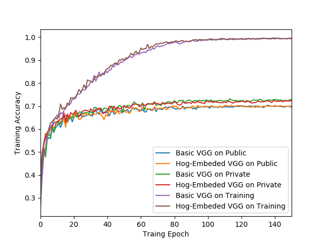
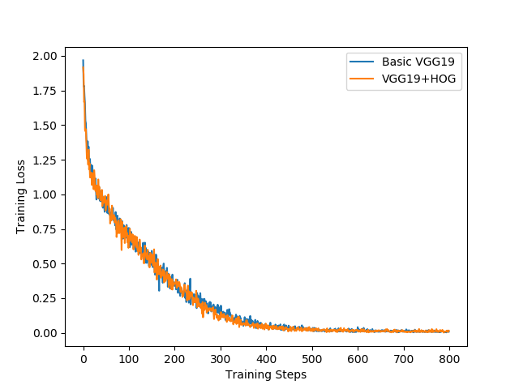
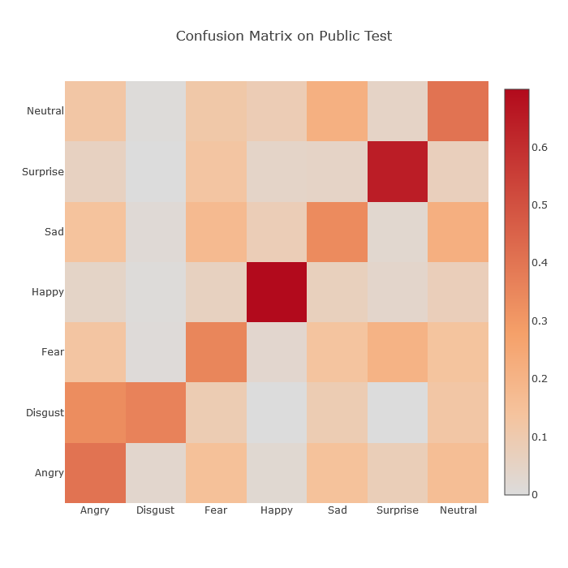
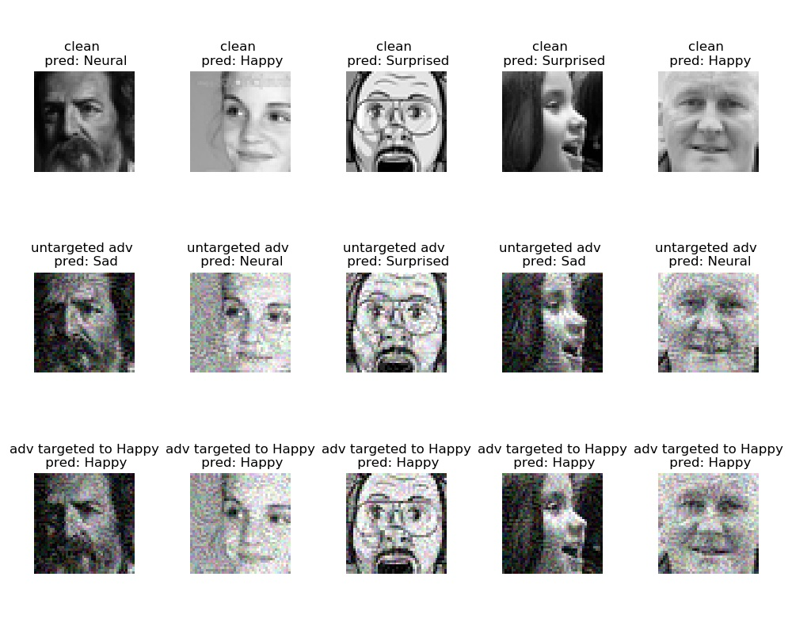
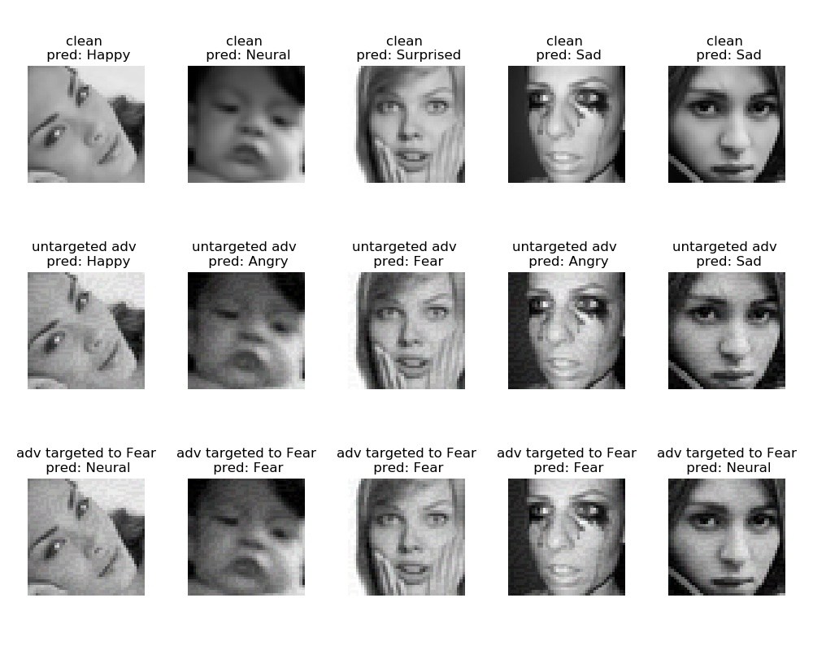

## Final Machine Learning Project for CS420 SJTU 2019

------

#### Description

------

This is the course final project for CS420, which is a classification test on the facial expression dataset fer2013. The soruce code are in the `src` folder. 

The project report has been also uploaded (Jan, 2020). The whole following information can be found in the report.

#### Team Members

------

- Bohong Wu	 吴薄鸿 516030910365
- Hao Sun    孙豪  516030910362

#### Requirements

------

- Numpy
- matplotlib
- scikit-learn
- PyTorch
- Advertorch

#### Usage

------

##### Prepare data
You can split the data into training.csv, valdata.csv, and testdata.csv. Or (recommanded) you can download the data on [this link](https://pan.baidu.com/s/1jMNWFiWYDHIScltZrv_9kQ ) with password zcy0

##### Train a model

Before training any model, first make sure the relative paths are correct. We have provided our splited data in `data` folder.

1. To train the basic VGG model, `python train_vgg.py`
2. To train the HOG-embedded model, `python train_vgghog.py`
3. To train a model with data augmented by Gaussian Noise, `python train_with_gaussian.py`

The validation is provided with the training scripts.

##### Pretrained models

The pretrained models are available on [this link](https://pan.baidu.com/s/11ybxZubWYgcNzajODBBk4Q) with no password.

#### Training Curves

------

The accuracy curves.

The loss curves.

#### Accuracy

------

|       Type      |  Basic  | HOG-embedded |
| :-------------: | :-----: | :----------: |
| Private accuracy| 72.67%  |    72.56%    |
| Public accuracy | 70.44%  |    70.97%    |

#### Error Analysis

------

The confusion matrix. 

#### Attacks

------

LinfPGDA attack. 

FGSM attack

#### Defenses

------

|   Method    | Raw VGG | Add Gaussian | Add DAE | DAE embedded |
| :---------: | :-----: | :----------: | :-----: | :----------: |
|  Original   | 65.28%  |    68.32%    | 49.04%  |    65.12%    |
| Adversarial | 49.04%  |    54.86%    | 46.04%  |    57.15%    |

To validate the results on the defenses methods, change the filepath in `/src/acc_on_attack`and modified the relative function. `python acc_on_attack.py`
